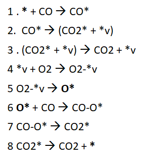
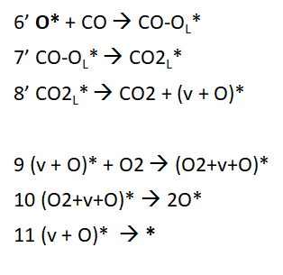
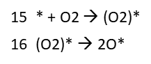

# Bayesian Calibration of CO Oxidation Microkinetics

[](https://www.python.org/)
[](LICENSE)
[](https://doi.org/10.1021/acscatal.2c03194)

A Python implementation of a microkinetic model and Bayesian calibration workflow for lean CO oxidation over isolated Pd sites on CeO2(100).

The model describes the dynamic interconversion of Pd, PdO, and PdO2-related surface states through a 19-step reaction network. It predicts CO oxidation rates, surface coverages, reaction orders in CO and O2, apparent activation barriers, and degrees of rate control. The Bayesian workflow adjusts DFT-derived reaction energies and activation barriers so that the microkinetic predictions better reproduce experimental kinetic observables.

This repository accompanies the study:

> L. Wang, S. Deo, A. Mukhopadhyay, N. A. Pantelis, M. J. Janik, and R. M. Rioux, “Emergent Behavior in Oxidation Catalysis over Single-Atom Pd on a Reducible CeO2 Support via Mixed Redox Cycles,” *ACS Catalysis* **12** (2022), 12927–12941. https://doi.org/10.1021/acscatal.2c03194

## Features

- Transient integration of a 15-species surface-coverage model to approximate steady state.
- Thermodynamically consistent forward and reverse rate constants.
- Prediction of the total CO2 formation rate from multiple catalytic pathways.
- Calculation of CO and O2 reaction orders using local log–log regressions.
- Calculation of the apparent activation barrier from an Arrhenius regression.
- Degree-of-rate-control analysis for the 19 elementary steps.
- Bayesian updating of DFT reaction energies and selected activation barriers.
- Automatic generation of MCMC traces, posterior distributions, and kinetic-observable plots.

## Reaction Network

The network includes CO adsorption and oxidation, CO2 desorption, oxygen-vacancy chemistry, lattice-oxygen pathways, O2 adsorption and dissociation, and crossover between Pd redox states.

### Reactions 1–8



### Reactions 6′–11



### Reactions 12–14


### Reactions 15–16: O2 adsorption and dissociation



## Repository Structure

```text
Bayesian_CO_oxidation/
├── Bayesian/
│   ├── Bayesian.py          # Interactive MCMC calibration workflow
│   ├── MKM.py               # Original microkinetic model
│   ├── MKM_corrected.py     # MKM evaluated with proposed energetics
│   └── README.md
├── MKM/
│   ├── MKM.py               # Standalone microkinetic model
│   └── README.md
├── Figures/                 # Reaction-network diagrams
├── examples/
│   ├── README.md
│   └── output/              # Example MCMC output and diagnostic figures
├── LICENSE
└── README.md
```

## Requirements

The scripts use the following Python packages:

- NumPy
- SciPy
- Matplotlib
- scikit-learn

Install them with:

```bash
python -m pip install numpy scipy matplotlib scikit-learn
```

The repository does not currently provide pinned dependency versions or a packaged installation configuration.

## Installation

```bash
git clone https://github.com/Shyamdeokr/Bayesian_CO_oxidation.git
cd Bayesian_CO_oxidation
python -m pip install numpy scipy matplotlib scikit-learn
```

A virtual environment is recommended:

```bash
python -m venv .venv
source .venv/bin/activate       # Linux or macOS
# .venv\Scripts\activate        # Windows
python -m pip install --upgrade pip
python -m pip install numpy scipy matplotlib scikit-learn
```

## Quick Start: Bayesian Calibration

Run the Bayesian workflow from inside the `Bayesian` directory so that the local imports and output path resolve correctly:

```bash
cd Bayesian
python Bayesian.py
```

The script interactively requests:

1. The number of DFT reaction-energy entries.
2. A comma-separated vector of 16 DFT reaction energies, in eV.
3. The number of activation-barrier entries.
4. A comma-separated vector containing 19 activation-barrier positions, in eV.
5. Temperature, in K.
6. CO and O2 partial pressures as `PCO,PO2`.

An input sequence based on the values included in the source-code comments is:

```text
Total number of DFT reaction energies: 16
Enter delE (DFT reaction energies to be corrected): -1.662,0.348,-0.167,-1.067,-0.449,-0.64,0.432,0.726,-1.483,0.438,-1.657,-0.761,-1.667,0.516,-1.738,-0.3
Total number of DFT activation barriers: 19
Enter dEa (DFT activation barriers to be corrected): 0,0.336,0,0,0.488,0,0.304,0,0,0.365,0,0,0.685,0.168,0,0.881,0,0,0.877
Enter Temperature in Kelvin (K): 473
Enter Pressure PCO,PO2: 0.02,0.20
```

### Calibrated Observables

The likelihood currently compares model predictions against three experimental targets defined directly in `Bayesian/Bayesian.py`:

```python
exp_rxn_order_CO = 1.3
exp_rxn_order_O2 = -0.13
exp_act_barrier = 0.67  # eV
```

Change these values to calibrate against another experimental dataset.

### Number of MCMC Iterations

The default is:

```python
iterations = 50
```

This is suitable for demonstrating the workflow but is generally too short for a converged posterior analysis. Increase the chain length and assess burn-in, mixing, autocorrelation, and convergence before drawing quantitative conclusions.

## Input Conventions

### Reaction-Energy Vector

`delE` contains 16 independently supplied reaction energies. `MKM_corrected.py` maps these values onto the 19-step network. Some network energies are shared or derived to preserve the chosen cycle energetics.

The supplied entries correspond to:

1. CO adsorption
2. First CO2 desorption
3. O2 adsorption in a vacancy
4. O2 dissociation in the vacancy
5. Second CO adsorption
6. Second CO oxidation
7. Second CO2 desorption
8. CO2 desorption leading to `(V+O)*`
9. O2 adsorption at `(V+O)*`
10. O2 dissociation at `(V+O)*`
11. O migration from `(V+O)*` to `*`
12. CO adsorption at `2O*`
13. CO oxidation at `2O*`
14. CO2 desorption from `O*`
15. O2 adsorption on `*`
16. O2 dissociation on `*` to form `2O*`

### Activation-Barrier Vector

`dEa` is represented as a 19-entry vector aligned with the full reaction network. The Bayesian sampler updates the entries at indices:

```text
1, 4, 6, 9, 12, 13, 15, 18
```

All other entries are set to zero or handled through adsorption/desorption energetics and thermodynamic constraints in the present implementation.

### Units

- Reaction energies and activation barriers: eV
- Temperature: K
- Rates: internal model units determined by the transition-state-theory formulation
- Surface coverages: fractional monolayer/site fractions

> **Pressure-unit caution:** the interactive prompt in `Bayesian.py` currently says kPa, while the MKM source comments and default values describe partial pressures in bar. Review the model convention and use one consistent pressure unit before applying the code to a new dataset.

## Running the Standalone Microkinetic Model

The standalone implementation is located in `MKM/MKM.py`:

```bash
cd MKM
python MKM.py
```

The default source code evaluates the model near:

```python
T = 473
P = [0.02, 0.20]
```

The module provides functions for:

```python
get_rate_constants(T)
get_rates(theta, kf, kr, P)
get_odes(theta, t, kf, kr, P)
solve_ode(kf, kr, theta0, P)
print_output(theta0, T, P)
rxn_order_CO(T, P)
rxn_order_O2(T, P)
apparent_barrier(T, P)
degree_of_rate_control(theta0, T, P)
```

The ODE solver starts from an empty surface and integrates to `1E6` s. Confirm that the final state is independent of the integration horizon and initial condition before treating it as a steady-state solution.

## Outputs

`Bayesian.py` creates an `output/` directory in the current working directory and writes:

```text
output/
├── MCMC_DFT_energetics_corrected_bayesian
├── DFT_reaction_energies_MCMC_posteriors.png
├── DFT_reaction_energies_MCMC_posteriors_distribution.png
├── DFT_activation_barrier_MCMC_posteriors.png
├── DFT_activation_barriers_MCMC_posteriors_distribution.png
└── rxnorders&barriers_Bayesian.png
```

The extensionless `MCMC_DFT_energetics_corrected_bayesian` file is a Python pickle containing:

```python
sample[0][0]  # accepted reaction-energy samples
sample[0][1]  # accepted activation-barrier samples
sample[1][0]  # predicted CO reaction order
sample[1][1]  # predicted O2 reaction order
sample[1][2]  # predicted apparent activation barrier
```

Load it with:

```python
import pickle

with open("output/MCMC_DFT_energetics_corrected_bayesian", "rb") as handle:
    sample = pickle.load(handle)
```

Only load pickle files from trusted sources.

## Bayesian Formulation

For each MCMC iteration, the workflow:

1. Proposes new reaction energies and selected activation barriers from truncated-normal distributions.
2. Evaluates the corrected microkinetic model.
3. Calculates predicted CO and O2 reaction orders and the apparent activation barrier.
4. Evaluates a likelihood centered on the experimental observables.
5. Accepts or rejects the proposed energetic parameters using a Metropolis-style criterion.
6. Records the energetic samples and predicted kinetic observables.

The current proposal widths, bounds, likelihood standard deviations, and experimental targets are hard-coded in `Bayesian.py` and should be reviewed for each new application.

## Important Implementation Notes

- This is research code associated with a specific reaction network and dataset; it is not yet a general-purpose microkinetics package.
- The script does not currently validate the lengths of the user-provided vectors despite asking for their sizes.
- MCMC convergence diagnostics are not calculated automatically.
- The likelihood is computed as a direct product of probability densities and can underflow for poorly matching proposals. A log-likelihood formulation is preferable for larger or more complex problems.
- Some plotting calls use division in subplot dimensions. With modern Python/Matplotlib versions, replace expressions such as `len(delE)/4` with integer-valued dimensions such as `len(delE)//4` if a subplot-dimension error occurs.
- The code uses `from ... import *`; explicit imports are recommended when extending or refactoring the workflow.
- Numerical stability and steady-state convergence should be checked whenever energetics or operating conditions are changed substantially.

## Reproducing the Included Example

The `examples/output/` directory contains a short illustrative MCMC run and its generated figures. The example README notes that only 10 MCMC iterations were used for illustration; it should not be interpreted as a converged Bayesian posterior.

## Extending the Model

To adapt the workflow to a new catalyst, mechanism, or experimental dataset, update:

- Reaction energies and activation barriers in `MKM.py` and their mapping in `MKM_corrected.py`.
- Surface intermediates, site balance, elementary rates, and ODEs.
- Experimental reaction orders and apparent activation barrier in `Bayesian.py`.
- Prior bounds and proposal widths.
- Likelihood uncertainties.
- MCMC length and convergence analysis.
- Pressure, entropy, standard-state, and rate-unit conventions.

## Citation

Please cite the associated publication when using or adapting this model:

```bibtex
@article{Wang2022Emergent,
  author  = {Wang, Linxi and Deo, Shyam and Mukhopadhyay, Ahana and Pantelis, Nicholas A. and Janik, Michael J. and Rioux, Robert M.},
  title   = {Emergent Behavior in Oxidation Catalysis over Single-Atom Pd on a Reducible CeO2 Support via Mixed Redox Cycles},
  journal = {ACS Catalysis},
  year    = {2022},
  volume  = {12},
  number  = {20},
  pages   = {12927--12941},
  doi     = {10.1021/acscatal.2c03194}
}
```

## License

This project is distributed under the [MIT License](LICENSE).
