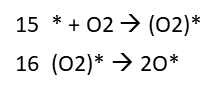

# Microkinetic Model
> This python code simulates the Pd site dynamics on CeO2(100) under lean CO oxidation, TOF for CO oxidation, Reaction orders in CO and O2 as well as the rate limiting step and the coverage of the intermediate species under reaction conditions of the following extensive reaction network.

## Reaction network for CO Oxidation on Pd sites - (Pd), (PdO) and (PdO2) + O2 adsorption

## Reactions - 1 - 8
# 

## Reactions 6' - 11
# 

## Reactions 12-14
# 

## Reactions 15-16 for O2 adsorption on Pd
# 
